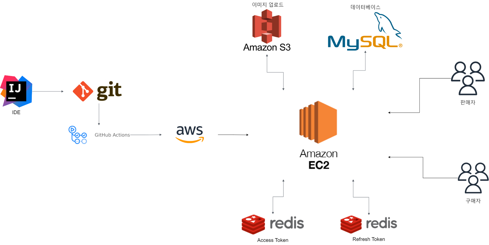
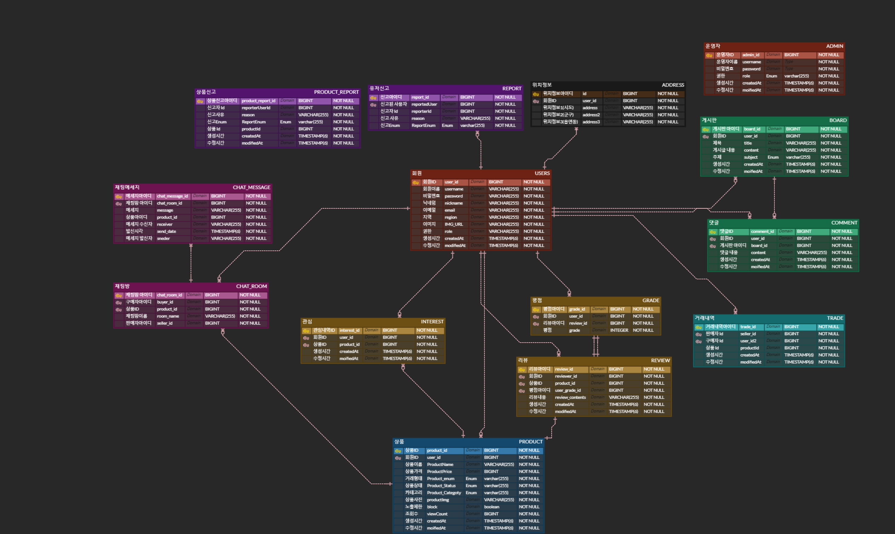

 

내가 필요한 물건을 판매하는 이웃에게 knock, knock!  
내게 필요한 물품을 이웃에게, 이웃이 필요한 물품을 내가 직접 이웃과 채팅으로 이야기 하며 
안전한 직거래 방식으로 거래 할 수 있는 웹 사이트 입니다. 

 

---
## 👤 팀원 구성

- 김민수(리더) 
- 이영빈(부리더) 
- 유성재 
- 정의준 
- 박서우 

---

## 🔨 프로젝트 기술 스택  

  
  
  
  
  
 
  
  
 
 
 
 
 
 
 
 
 
 
 

 

---

## 📋 전체 프로젝트의 구조

4989-8685-011288fc0414/image.jpg" width="600px">

 

---

## 📋 커밋 규칙 & PR Template

### ✅ merge 후 사용 끝난 branch는 즉시 삭제
🛑 커밋 예시 : `#Issue Number <type>(<className>):이유, 설명 ... `  
🛑 merge 시간 준수 : `pm 02:00`, `pm 08:00` 
🛑 구글 코딩 컨벤션으로 통일`

### ✅ Commit Type
`feat` : 새로운 기능 추가 
`fix`: 수정 
`docs` : 문서 수정 
`style`: code formatting 
`refactor` : 코드 리펙토링 
`test` : 테스트 코드, 리펙토링 코드 추가 
`chore`: 빌드 업무 수정 
`rename` : 파일 or 폴더명 수정 및 옮기는 작업 
`remove` : 파일 삭제 작업
 ### ✅ PR Template
 

 

---

## 📋 주요 기능
✅ 회원 가입시 이메일 인증을 통해 본인인증을 해야 가입이 가능하다. 
✅ 구글로 로그인은 이메일 인증 불필요 
✅ 관리자를 제외한 모든 유저는 별다른 인증없이 판매와 구매 모두 할 수 있다. 
✅ 신고를 15번 이상 당한 유저는 사이트 이용 정지가 된다.  
✅ GPS 기능을 사용해 동네 인증을 한다. 
✅ 구매를 원하는 상품에 대해 판매자와 1:1 채팅이 가능하다. 
✅ 모든 유저는 게시판을 사용하여 소통할 수 있다. 
✅ 모든 유저는 게시판에 댓글을 달 수 있다. 
✅ 마음에 드는 상품에 대해 관심 상품 등록을 할 수 있다. 
✅ 구매한 상품에 대해 리뷰와 별점을 달 수 있다.

 

---

## 📋 DB ERD

 

---

## 📋 knock knock 페이지 

### ✅ 메인 페이지

### ✅ 채팅 페이지

 

---

## 📋 API 명세서

- 사용자 API

  [API명세(user)](https://www.notion.so/19cd7481c2b644149183549a687d00e1)

- 어드민 API

  [API명세(Admin)](https://www.notion.so/e14fccf62614423cb455b08c8efcaf5e)

- 상품 API

  [API명세(Product)](https://www.notion.so/81d03bcf86964740bd7f3beb03355ff0)

- 게시판 API

  [API명세(Board)](https://www.notion.so/f3d80159378e4668ba24c2be2dbd2bd1)

- 댓글 API

  [API명세(Comment)](https://www.notion.so/f58cdca565aa410794817c27feeadd1e)

- 이미지 API - multipartfile

  [API명세(Image)](https://www.notion.so/e6753aa4cb754e26b00ec9b397a82305)

- 거래내역 API

  [API명세(Transaction_History)](https://www.notion.so/3f228754250445f9b26ab02ed4e8fea8)

- 관심내역 API

  [API명세(Interest)](https://www.notion.so/9b0e0d3ee4fe442f85b81647f202b246)

- 신고내역 API

  [API명세(Report)](https://www.notion.so/279b491a9a70434faa272589770893d2)

  [API명세(Review)](https://www.notion.so/fedb3776fb9843fbb025598a6fad8cfc)

- 채팅 API

  [API명세(Report)](https://www.notion.so/8b5b4e7faad04f958255f5c2ae5f5416)

- 이메일 인증 API

  [API명세(Report)](https://www.notion.so/4736f2ae235544cba00d24f896593045)

